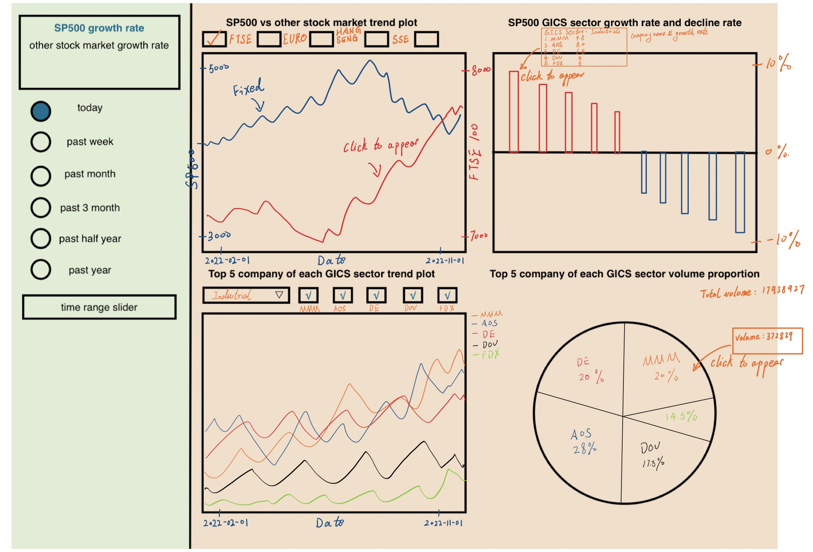

# Stock Market Dashboard

Link to our dashboard: https://data551dash.herokuapp.com

Welcome to our stock market dashboard! This dashboard provides a variety of visualizations to help users explore and understand stock market trends and performance.

## Motivation

We created this dashboard to make it easier for traders and investors to access and evaluate crucial stock market data fast. Our objective is to offer a simple and user-friendly interface that makes it simple for consumers to spot trends and take wise judgments.

## Usage

The two primary components of our dashboard are a sidebar on the left and four graphs on the right. In addition to time selectors for deciding what time period should be shown on the graphs, the sidebar provides general information about the stock market.

The four graphs on the right show the performance and trends of the stock market in great detail. Users can compare various stock markets using a checkbox selector in the trend plot in the top left corner, which shows the average SP500 price over time.

The growth and decline rates of each GICS sector of the SP500 are displayed in the bar chart in the top right corner. The two plots at the bottom allow users to examine the top 5 companies in a particular sector by selecting it from the dropdown list at the bottom. Users can select which companies to display using the checkbox selector on the trend plot on the left, which displays the price change for the selected companies. The percentage of volume for the chosen companies is displayed in the pie chart on the right.

## Contributing

Anyone interested in helping us improve our dashboard is welcome to contribute. Clone our repository, then use pip to install the required dependencies. The python app.py command can then be used to run the application locally. To assist us in improving the dashboard, feel free to submit bug reports, feature requests, or pull requests.

We appreciate you utilizing our dashboard! We sincerely hope you find it insightful and helpful. Please get in touch with us if you have any inquiries or comments.
